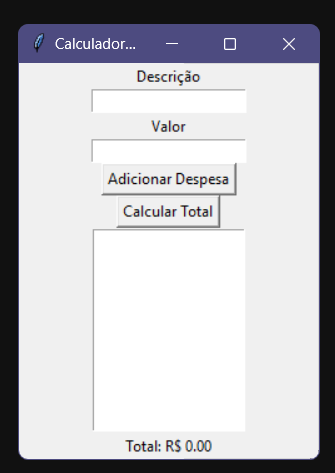

# Calculadora de Despesas em Python com Tkinter 🧮

Este é um simples aplicativo de calculadora de despesas criado em Python usando a biblioteca Tkinter. A aplicação permite que você insira suas despesas diárias com descrição e valor, calcule o total das despesas inseridas e exiba o resultado na interface gráfica.



## Funcionalidades 

- Adicione despesas com descrição e valor.
- Calcule o total das despesas inseridas.
- Interface de usuário simples e intuitiva.

## Como Usar 🚀

1. Clone ou faça o download deste repositório.

2. Navegue até o diretório onde o código-fonte está localizado.

3. Execute o aplicativo com o seguinte comando:

   ```bash
   despesas.py
   ```

   Certifique-se de que o Python 3.x esteja instalado em seu sistema.

4. A interface gráfica será exibida. Você pode começar a adicionar suas despesas.

5. Insira a descrição e o valor da despesa nos campos apropriados e clique no botão "Adicionar Despesa".

6. Para calcular o total das despesas inseridas, clique no botão "Calcular Total".

7. O resultado será exibido na parte inferior da janela.

## Contribuições 😊

Contribuições são bem-vindas! Sinta-se à vontade para abrir problemas (issues) ou enviar solicitações de pull (pull requests) para melhorar este projeto.

## Autor 👔

- [Ródiney Wanderson](https://github.com/rodineyw)

## Licença 🪪

Este projeto é licenciado sob a Licença MIT - consulte o arquivo [LICENSE](LICENSE) para obter detalhes.